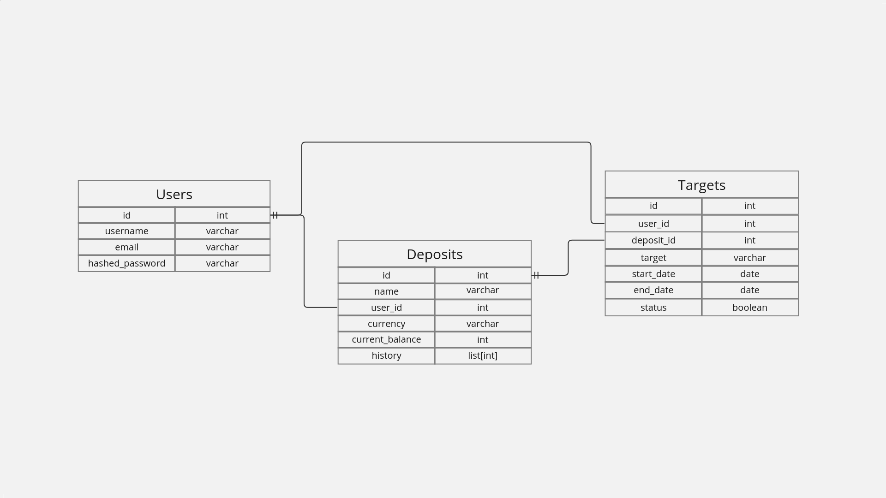

# Financial API
Simple async API on Python to track your financial flows

## Introduction
These days financial literacy of the population is actively growing. Why not to make API to track your own financial flows?

## For what
I made this pet project for practice FastAPI trying to implement best practices of clean code and "dont repeat yourself". Also beginner Frontend developers can use this API for practice Frontend.

## Libraries
- FastAPI
- Pydantic
- Alembic
- SQLAlchemy

## Database
In project I used PostgreSQL (marvelous). 
Below u can see dependencies between tables in database

